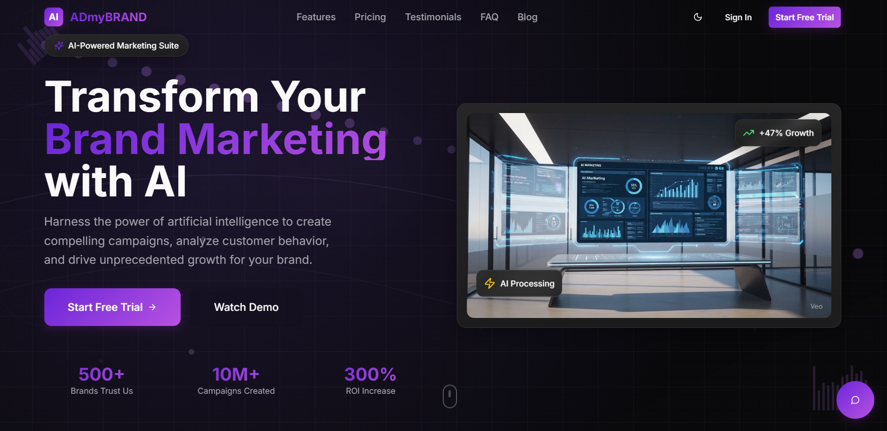

# ADmyBRAND Vision Hub 🚀

An AI-powered marketing suite that transforms brand marketing through intelligent automation and data-driven insights.

## 🌟 Features

### 1. AI Marketing Assistant
- **Interactive Chatbot**: Real-time AI assistance for marketing queries
- **Quick Action Menu**: Easy access to key features and information
- **Smart Response System**: Context-aware responses with markdown support
- **Dynamic UI**: Sleek animations and responsive design

### 2. Core Marketing Features
- **AI Campaign Creation**: Generate high-converting campaigns in minutes
- **Smart Audience Targeting**: AI-powered demographic analysis
- **Multi-platform Integration**: Facebook, Google, Instagram, LinkedIn & more
- **A/B Testing Automation**: Optimize campaigns automatically
- **Brand Voice Generator**: Consistent messaging across channels

### 3. Pricing Tiers 💰
#### Starter Plan - $29/month
- Up to 5 campaigns
- Basic analytics
- Email support

#### Professional Plan - $79/month ⭐
- Unlimited campaigns
- Advanced AI features
- Priority support
- Custom integrations

#### Enterprise Plan - $199/month
- Everything in Pro
- Dedicated account manager
- Custom AI training
- White-label options

### 4. Technical Stack

#### Frontend
- **Framework**: React + TypeScript
- **Styling**: Tailwind CSS + Shadcn/ui Components
- **Build Tool**: Vite
- **State Management**: React Hooks
- **Animations**: CSS Transitions & Transforms

#### UI Components
- Custom Chatbot Interface
- Responsive Navigation
- Hero Section
- Features Section
- Pricing Cards
- Testimonials
- FAQ Accordion
- Footer

#### Design Features
- Glass-morphism effects
- Dark mode support
- Gradient animations
- Responsive layouts
- Interactive hover states
- Custom scrollbars

## 🚀 Getting Started

### Prerequisites
- Node.js 16+
- npm or Bun

### Installation

1. Clone the repository
\`\`\`bash
git clone https://github.com/adithyaadhi505/admybrand-vision-hub.git
cd admybrand-vision-hub
\`\`\`

2. Install dependencies
\`\`\`bash
# Using npm
npm install

# Using Bun
bun install
\`\`\`

3. Start the development server
\`\`\`bash
# Using npm
npm run dev

# Using Bun
bun run dev
\`\`\`

## 📊 Demo Data

### Sample Marketing Stats
- 500+ Brands Trust Us
- 10M+ Campaigns Created
- 300% ROI Increase

### Sample Testimonials
1. Sarah Johnson, CMO at TechFlow
   - "Increased conversion rates by 340% in 2 months!"

2. Mike Chen, Digital Marketing Agency
   - "Saved 15+ hours per week on campaign creation"

3. Lisa Rodriguez, E-commerce Director
   - "Best marketing investment with immediate ROI"

### Blog Content
- AI-Powered Analytics Insights
- Marketing Transformation in 2024
- Future of AI in Advertising
- Top 5 AI Marketing Tools

## 🎨 UI/UX Features

### Chatbot Functionality
- Persistent chat history
- Smart message suggestions
- Quick action buttons
- Real-time typing indicators
- Smooth animations
- Responsive layout
- Glass-morphism design

### Navigation
- Smooth scrolling
- Responsive menu
- Active state indicators
- Custom animations
- Dark mode toggle

## 🛠 Development

### Project Structure
\`\`\`
src/
├── components/          # Reusable UI components
│   ├── ui/             # Shadcn UI components
│   └── sections/       # Page sections
├── pages/              # Route pages
├── hooks/              # Custom React hooks
├── lib/               # Utilities and helpers
└── assets/            # Static assets
\`\`\`

### Key Components
- `Chatbot.tsx`: AI Assistant interface
- `Navigation.tsx`: Main navigation bar
- `HeroSection.tsx`: Landing page hero
- `FeaturesSection.tsx`: Features showcase
- `PricingSection.tsx`: Pricing plans
- `TestimonialsSection.tsx`: User reviews
- `FAQSection.tsx`: Frequently asked questions

## 📱 Responsive Design
- Mobile-first approach
- Breakpoints:
  - sm: 640px
  - md: 768px
  - lg: 1024px
  - xl: 1280px

## 🔒 Security
- SOC 2 compliant
- Bank-level encryption
- Secure data handling

## 🌐 Browser Support
- Chrome (latest)
- Firefox (latest)
- Safari (latest)
- Edge (latest)

## 📄 License
Copyright © 2025 ADmyBRAND. All rights reserved.

---

Built with ADITHYA N T
CONTACT : adithyant982@gmail.com